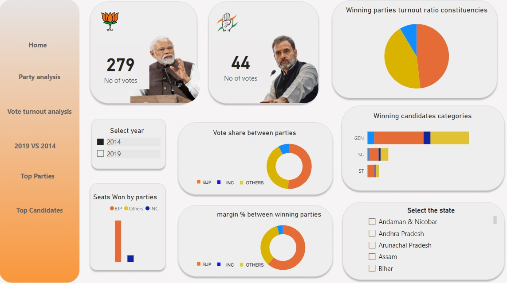

# 🗳️ **Loksabha Election Data Analysis**

Welcome to my **interactive Power BI dashboard**, where I explore the Loksabha elections of **2014 and 2019**, and predict the results for **2024**!

## **Highlights**

- **Interactive Dashboard**: Multiple pages of detailed insights.
- **Real-Time Data**: Accurate info from the Election Commission of India.
- **Predictive Analysis**: Forecasting the 2024 election results.
- **User-Friendly Interface**: Easy navigation for all users.

## **Key Features**

- **State Analysis**: Explore voting patterns and trends across different states.
- **Constituency Analysis**: Dive into detailed data at the constituency level.

 

## **Why This Project?**

Understanding electoral data provides insights into **political trends** and **voter behavior**. This project aims to make this data **accessible** and **engaging**.

## **Explore the Dashboard**

Dive into the visualizations and uncover the story behind the numbers.
